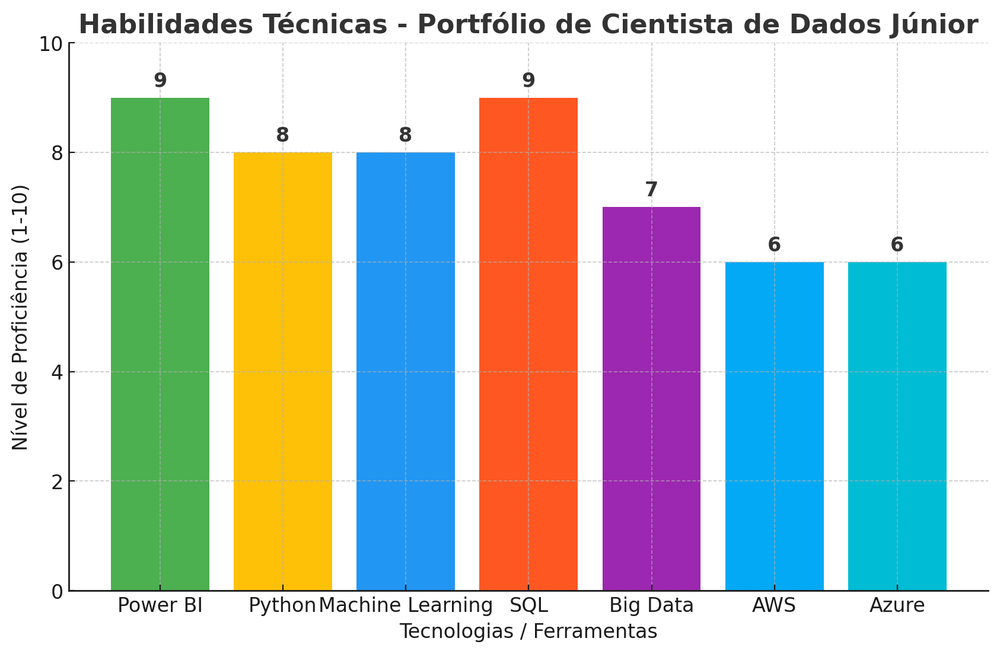
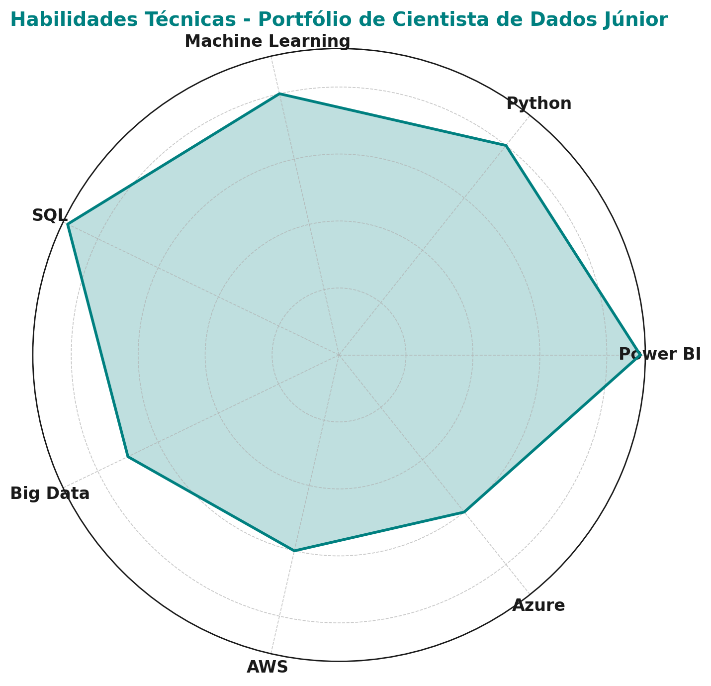

# Portfólio de Cientista de Dados Júnior - Mateus Felipe Barbosa Lopes

Bem-vindo ao meu portfólio de Cientista de Dados Júnior! Neste repositório, compartilho meus projetos e habilidades como cientista de dados.

## Objetivo Profissional
Sou Cientista de Dados Júnior, com uma forte formação em Ciência de Dados e Big Data, e experiência prática em análise de dados, Machine Learning, e engenharia de dados. Busco uma oportunidade onde possa aplicar minhas habilidades em Python, SQL, Power BI, e ferramentas de Big Data para solucionar problemas complexos e gerar insights valiosos para o negócio.

## Projetos

### 1. Análise Temporal e Preditiva dos Padrões de Criminalidade
- **Descrição**: Neste projeto, realizei uma análise dos padrões de criminalidade em Minas Gerais, utilizando Machine Learning para prever crimes violentos e furtos, além de comparar os períodos de pandemia e pós-pandemia.
- **Tecnologias**: Python, Pandas, Matplotlib, Seaborn, Scikit-Learn, Random Forest, KNN, Regressão Logística.
- **Link do Projeto no Google Colab**: [Google Colab - TCC](https://colab.research.google.com/drive/1soF_Rxi7KSy3Alecxe6i_ycBlUoxe8vJ?usp=sharing)

### 2. Visualização de Habilidades Técnicas - Gráfico de Barras
- **Descrição**: Criei um gráfico de barras para representar as minhas principais habilidades técnicas e o nível de proficiência em cada uma delas.
- **Tecnologias**: Python (Matplotlib).
- **Gráfico**: Veja abaixo o gráfico de habilidades técnicas.

)

### 3. Visualização de Habilidades Técnicas - Gráfico de Radar
- **Descrição**: Para uma visualização mais completa, também criei um gráfico de radar para representar as minhas habilidades técnicas.
- **Tecnologias**: Python (Matplotlib).
- **Gráfico**: Veja abaixo o gráfico de radar.



## Habilidades Técnicas
- **Python**: Proficiência alta, utilizado em diversas ferramentas de análise e Machine Learning.
- **SQL**: Habilidade em consultas SQL para extração e manipulação de dados.
- **Power BI**: Experiência em criar dashboards interativos e relatórios analíticos.
- **Machine Learning**: Implementação de modelos preditivos utilizando Random Forest, KNN e Regressão Logística.

## Como Rodar os Projetos
- Clone este repositório em seu ambiente local:
  ```bash
  git clone https://github.com/SEU_USUARIO/portfolio-cientista-de-dados.git
  ```
- Para rodar os notebooks no Google Colab, basta acessar os links disponíveis na seção de projetos e importar os arquivos.

## Contribuições
Caso queira contribuir, sinta-se à vontade para fazer um **fork** do repositório e enviar **pull requests** com melhorias ou sugestões de novos projetos.

## Licença
Este portfólio é de código aberto e pode ser utilizado para fins educacionais e profissionais.
